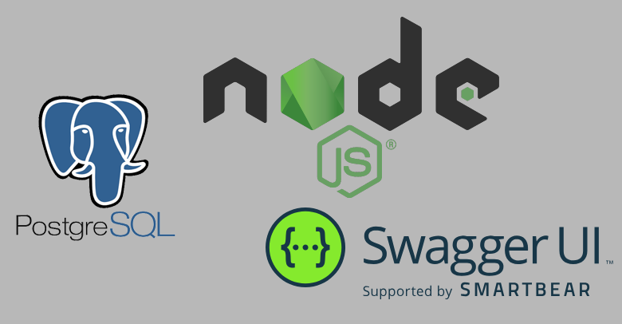
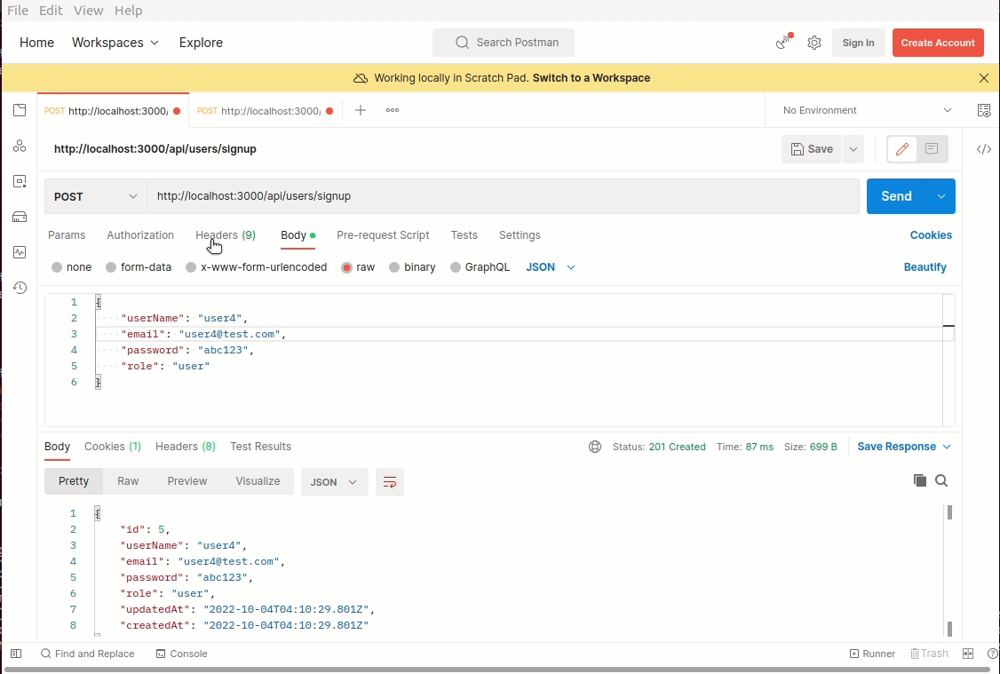

# Node.js Example Application - develop a CRUD REST API  
  
[Getting Started with Node](https://geekswithlatitude.readme.io/docs/getting-started-with-node)  
  
Node.js ORM tool: [Sequelize](https://sequelize.org/docs/v6/getting-started/)  
Database: [postgresql](https://www.postgresql.org/download/linux/ubuntu/)  
Test API tool:[Postman](https://www.postman.com/downloads/)  
Simplify API development:[Swagger](https://swagger.io/)  
[HTTP status code](https://developer.mozilla.org/en-US/docs/Web/HTTP/Status)  
  
  
### how to use  
$ npm install  
$ npm start  

### Demo: 
Node.js REST API using Swagger
  
  
Node.js REST API using Postman 
  
